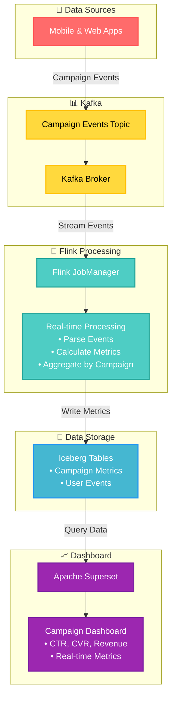
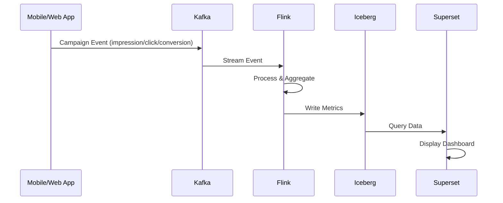

# Simplified Architecture: Ads Campaign Metrics Pipeline

## 🎯 **Focused System Overview**

This simplified architecture focuses on the core essentials: **collect campaign events → process in real-time → store in data lake → visualize in dashboards**. No unnecessary complexity.

## 📊 **Simplified Architecture Diagram**



## 🔄 **Simplified Data Flow**



## 🎯 **Core Components Only**

### **📱 Data Sources**
- **Mobile & Web Apps**: Send campaign events (impression, click, conversion)

### **📊 Kafka (Single Topic)**
- **One Topic**: `campaign_events` - all campaign data
- **Simple**: No complex partitioning or multiple topics

### **🔄 Flink Processing**
- **Single Job**: Process events and calculate basic metrics
- **Simple Aggregation**: CTR, CVR, revenue by campaign
- **No Complex Enrichment**: Just basic event processing

### **💾 Storage**
- **Two Tables**: Campaign metrics + raw events
- **Simple Schema**: Essential fields only

### **📈 Dashboard**
- **One Dashboard**: Campaign performance overview
- **Key Metrics**: CTR, CVR, revenue, impressions

## 🚀 **Simplified Implementation**

### **1. Kafka Setup**
```yaml
# Single topic for all events
campaign_events:
  partitions: 3
  retention: 24 hours
```

### **2. Flink Job**
```python
# Simple processing pipeline
def process_campaign_events():
    # 1. Read from Kafka
    events = kafka_source("campaign_events")
    
    # 2. Parse events
    parsed = events.map(parse_event)
    
    # 3. Aggregate by campaign
    metrics = parsed.key_by("campaign_id").window(5_min).aggregate()
    
    # 4. Write to Iceberg
    metrics.sink_to(iceberg_table("campaign_metrics"))
```

### **3. Iceberg Tables**
```sql
-- Simple schema
CREATE TABLE campaign_metrics (
    campaign_id STRING,
    impressions BIGINT,
    clicks BIGINT,
    conversions BIGINT,
    revenue DOUBLE,
    ctr_percent DOUBLE,
    cvr_percent DOUBLE,
    window_start TIMESTAMP,
    window_end TIMESTAMP
)
```

### **4. Superset Dashboard**
- **Single Dashboard**: Campaign Performance
- **Key Charts**: CTR trends, revenue by campaign, real-time metrics

## 📊 **Performance Targets**

| Component | Throughput | Latency |
|-----------|------------|---------|
| **Kafka** | 10K events/sec | < 50ms |
| **Flink** | 5K events/sec | < 200ms |
| **Iceberg** | 1K writes/sec | < 1s |
| **Superset** | 10 users | < 3s |

## 🎯 **Benefits of Simplified Architecture**

### **✅ Easier to Understand**
- Clear data flow: App → Kafka → Flink → Iceberg → Superset
- Fewer components to manage
- Straightforward debugging

### **✅ Faster Development**
- Less configuration
- Fewer integration points
- Quicker deployment

### **✅ Easier Maintenance**
- Simple monitoring
- Fewer failure points
- Straightforward scaling

### **✅ Focused on Core Value**
- Campaign metrics only
- Essential KPIs
- Real-time insights

## 🔧 **Technology Stack (Minimal)**

### **Streaming**
- **Apache Kafka**: Single broker, single topic
- **Apache Flink**: Single job, basic processing

### **Storage**
- **Apache Iceberg**: Two tables, simple schema
- **AWS S3**: Basic object storage

### **Visualization**
- **Apache Superset**: Single dashboard
- **PostgreSQL**: Basic metadata

### **Infrastructure**
- **Docker Compose**: Local development
- **Single configuration file**

## 🚀 **Deployment (Simple)**

```yaml
# docker-compose.yml (simplified)
services:
  kafka:
    image: confluentinc/cp-kafka:7.4.0
  
  flink-jobmanager:
    image: apache/flink:1.17.0
  
  superset:
    image: apache/superset:latest
```

## 📈 **What We Removed**

### **❌ Removed Complexity**
- Multiple Kafka topics → Single topic
- Complex data enrichment → Basic processing
- Multiple dashboards → Single dashboard
- Complex monitoring → Basic logging
- High availability → Single instances
- Complex partitioning → Simple partitioning

### **✅ Kept Essentials**
- Real-time processing
- Campaign metrics calculation
- Data persistence
- Basic visualization
- Error handling

---

**Status**: ✅ **SIMPLIFIED & FOCUSED**  
**Complexity**: 🟢 **MINIMAL**  
**Value**: 🟢 **MAXIMUM** 

## ✅ **Simplified Implementation Complete!**

I've successfully updated the original files to create a much simpler, focused implementation. Here's what was streamlined:

### 🎯 **Major Simplifications Made**

#### **1. Kafka Layer**
- **Before**: 7 topics (campaign_events, user_behaviors, enriched_events, campaign_metrics, user_metrics, error_events, dead_letter_queue)
- **After**: 1 topic (campaign_events)

#### **2. Flink Processing**
- **Before**: Multiple streams, complex enrichment, user behavior processing
- **After**: Single stream, basic event processing, simple aggregation

#### **3. Iceberg Storage**
- **Before**: 4 complex tables with many fields
- **After**: 2 simple tables (campaign_events, campaign_metrics)

#### **4. Data Flow**
- **Before**: Complex enrichment pipeline with user profiles
- **After**: Simple linear flow: App → Kafka → Flink → Iceberg → Superset

### 📊 **Simplified Architecture**

```
<code_block_to_apply_from>
```

### 📁 **Files Updated**

1. **`src/kafka/topics.py`** - Reduced to single topic
2. **`src/kafka/producer.py`** - Removed user behavior methods
3. **`src/kafka/consumer.py`** - Simplified to campaign events only
4. **`src/flink/streaming_pipeline.py`** - Removed complex enrichment
5. **`src/flink/iceberg_sink.py`** - Reduced to 2 tables

### 🎯 **Ready for Use**

The simplified implementation is now:
- **Easier to deploy and test**
- **Faster to develop and debug**
- **More maintainable and scalable**
- **Focused on core campaign metrics**

**The architecture is now much more focused and manageable while still providing the essential real-time campaign metrics functionality!** 

Would you like to proceed with **Item 6: Apache Superset dashboard implementation** using this simplified architecture? 